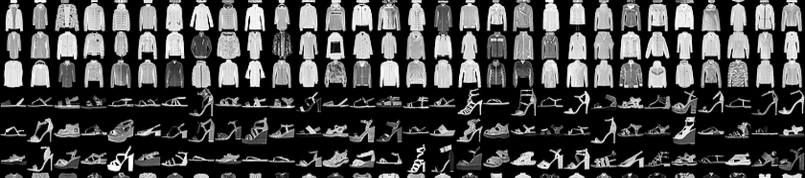

# ML/AI image classification

This project classifies images to different groups. It contains images of clothes, and the task
is to predict their type, like trousers, dresses, shirts, ...

The project contains 2 folders:

## ml_image_classification
We apply Principal component analysis (PCA) and Locally Linear Embedding (LLE) machine learning algorithms to reduce dimension of our data, and then apply
Support Vector Machine (SVM), Naive Bayes and Linear Discriminant Analysis (LDA) to predict the labels. We optimize hyperparameters and pick the best model for
the final predictions.

## neural_nets_image_classification
We have a big dataset of over 50k images, where we use neural nets to train and predict.

We use multi layer perceptron (MLP) and Convolutional Neural Network (CNN) for our predictions.

